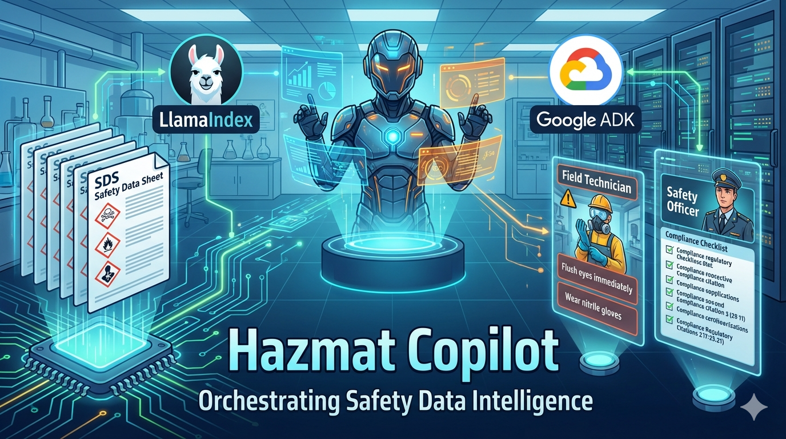
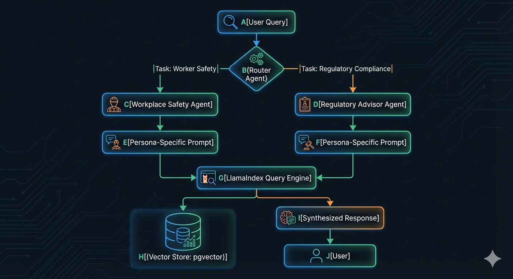
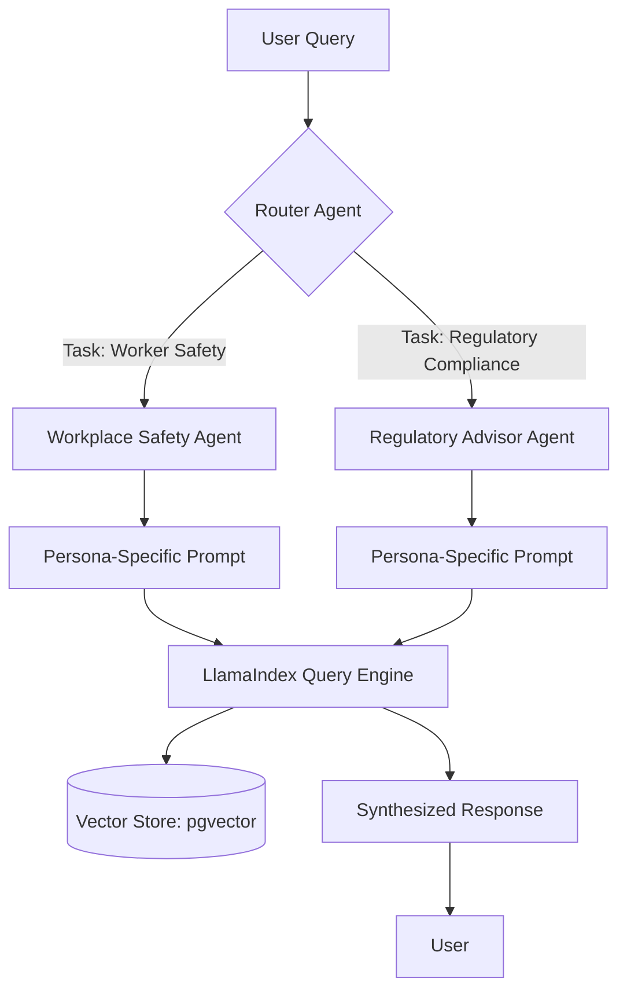

# Hazmat Copilot: Orchestrating Safety Data Intelligence with LlamaIndex and Google ADK

Safety Data Sheets (SDS) are the lifeblood of chemical safety, yet they remain one of the most challenging data sources to operationalize. They are dense, highly structured (yet effectively unstructured in practice), and serve audiences with wildly different needs. A frontline worker splashing a chemical on their skin needs a 3-word instruction; a compliance officer auditing facility storage needs a 3-page regulatory citation.

When we set out to build **Hazmat Copilot**, a RAG-powered assistant for hazardous materials, we quickly realized that a standard "search and summarize" pipeline would fail. We needed an architecture that could understand user intent, respect the strict hierarchy of SDS documents, and deliver persona-specific synthesis.

Here is how we built it using **LlamaIndex** as the data backbone and **Google ADK** for agent orchestration.

## The Problem Space: The SDS Challenge

An SDS consists of 16 standardized sections. While standardized, the content within is a mix of legal definitions, emergency protocols, and technical data.

We identified two primary personas with conflicting requirements:
1.  **The Field Technician**: Operates in hazardous environments. They need real-time, urgent, and highly actionable responses. They care about Section 8 (PPE) and Section 4 (First Aid).
2.  **The Safety Officer**: Focuses on compliance oversight and macro-level data trends. They need formal language, specific regulatory citations (Section 15), and 100% groundedness to avoid liability.

To serve both, the system must reduce latency in critical situations while ensuring zero tolerance for hallucinations in regulatory answers.

## Architectural Deep Dive: The Hybrid Pattern

A naive RAG implementation—dumping chunks into a vector store and querying them—fails here. The model often mixes up advice intended for compliance (Safety Officer) with immediate actions (Technician).

Instead, we implemented a **Hybrid of Information Synthesis Agent and Specialist/Router Orchestration**. An Information Synthesis Agent unifies and structures information gathered from diverse external systems and knowledge bases, often using Retrieval-Augmented Generation (RAG).

Here is the flow:

The **Router Agent** inspects the query and dispatches it to the appropriate specialist. The specialist agents are configured with distinct instructions and rubrics, ensuring the response matches the persona's expectations in tone and content density.

## The Framework Synergy: LlamaIndex + Google ADK

The magic happens in the pairing of these two frameworks.

*   **LlamaIndex** is our data backbone. We use it not just for vector storage, but for its advanced data indexing capabilities. SDS files are hierarchical by nature (Sections 1 through 16). LlamaIndex allows us to maintain that structure during ingestion, enabling precise retrieval.
*   **Google ADK** provides the agentic framework. It handles the tool-calling loops, state management, and crucially, the evaluation framework that keeps the system safe.

By combining them, we leverage Google’s robust infrastructure (running on Cloud Run with Cloud SQL) alongside LlamaIndex’s superior orchestration of multi-document retrieval.

## Technical Implementation & Features

Here are the key technical pillars of the implementation:

### 1. Semantic Chunking and Metadata Enrichment
We don't just chunk by character count. We parse the SDS files to identify section boundaries. During ingestion, we use Gemini to analyze Section 2 and extract structured metadata: `hazard_type`, `hazard_pictograms`, and `information_density`. This metadata is attached to the nodes in LlamaIndex, providing rich context that can be used to enhance retrieval precision in the future.

### 2. Agentic Reasoning Loops
The specialist agents don't just return the first RAG result. They operate in a reasoning loop supported by Google ADK, deciding if they need to fetch more context or if the retrieved information is sufficient to answer the prompt safely.

> [!NOTE]
> **Architect's Note: Why LlamaIndex for SDS?**
> I chose LlamaIndex specifically because of its focus on *indexing* and structured data integration. The hierarchical nature of SDS documents requires more than just flat vector search. By using LlamaIndex with `PGVectorStore`, we can store chunked sections with rich metadata, allowing our agents to retrieve highly specific context rather than guessing based on pure semantic similarity.

## The "Expert" Perspective: Decision Logic

**Why a Specialist Team instead of a single smart agent?**
In safety-critical domains, prompt engineering a single agent to handle all personas leads to prompt bloat and unpredictable behavior. By splitting the concerns into distinct agents (Workplace vs Regulatory), we can evaluate them independently. We can run evals specifically testing the Workplace agent for safety icon usage without penalizing the Regulatory agent for not using them.

## Interactive Demo

See the Hazmat Copilot in action:

You can run this interactive environment yourself by executing `make playground` in the repository root to start a web-based test environment. To explore different testing scenarios, check out the [sample prompts](./sample-prompts.md) file.

## Call to Action

The Hazmat Copilot demonstrates that operationalizing complex regulatory data requires more than just a standard RAG stack. It requires a thoughtful blend of structured data indexing and orchestrated agentic behavior.

Explore the implementation details in this repository:
*   Check out [`app/ingest.py`](../app/ingest.py) to see the metadata enrichment pipeline.
*   Review [`app/agent.py`](../app/agent.py) for the multi-agent setup.

To see the complete implementation and try it yourself, visit the [Hazmat Copilot GitHub repository](https://github.com/ameya-sap/hazmat-copilot). If you find this architecture useful, please consider giving it a star!

